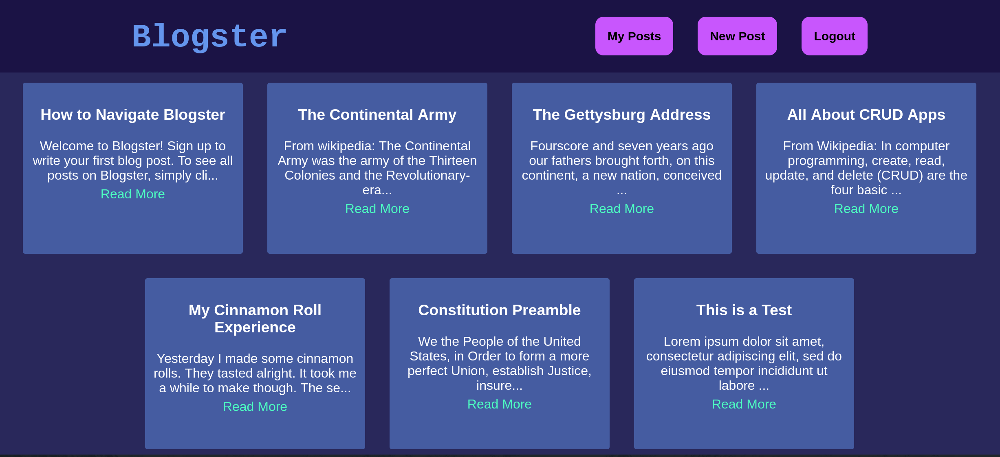

# Blogster

## Overview
Blogster is a full-stack CRUD application that enables bloggers to post their insights and consume content from other users. 

## Description
This application produces a mini blog with a variety of features. These include the ability to create an account, login or logout of your account, read all posts on Blogster via the Blogster link in the header, write a new post via the New Post button, edit or delete a post you created after viewing the details of your post, and view only the posts you created via the My Posts button. /

App deployed on Heroku: https://ui-blogster.herokuapp.com/
/

## Installation
Fork and clone this github repo: https://github.com/lenders-game/blogster \
Make sure you have Docker and Docker Compose installed. See below for more dependencies.\
In the api directory: `npm i`\
In the ui directory: `npm i`\
In the root directory: `docker compose up --build -d`

### Dependencies:
UI:
- React
- react-router-dom

API:
- Express
- Knex
- Bcrypt (for authentication)
- CORS
- pg
- Nodemon

Database:
- PostgreSQL